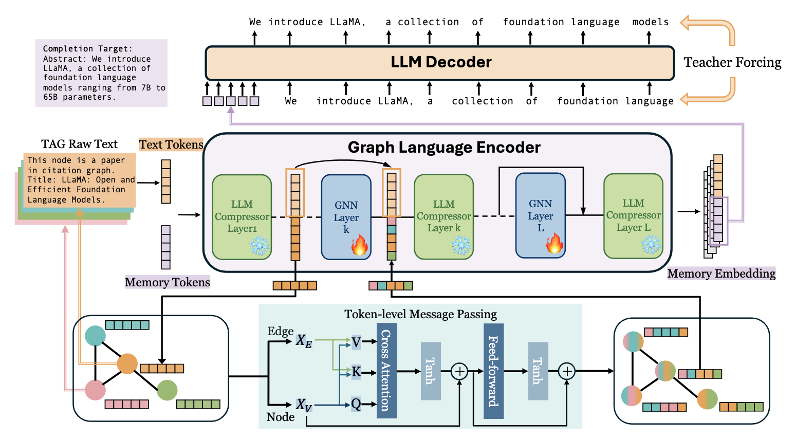
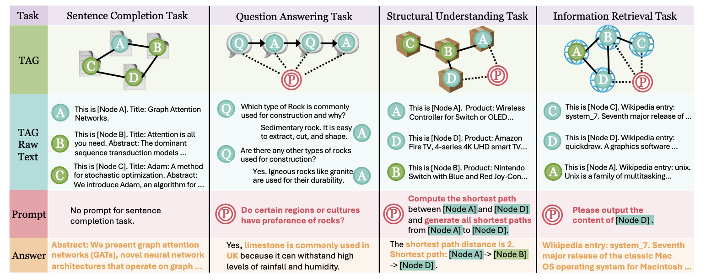
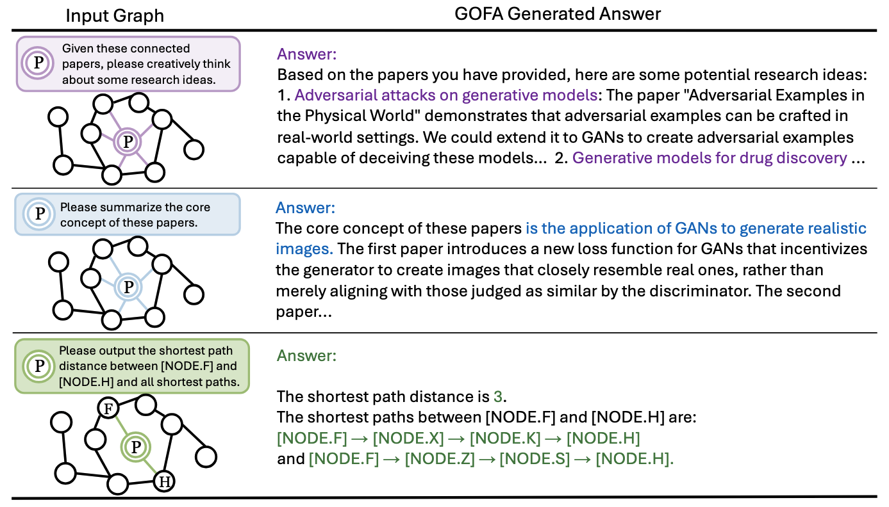

# Generative One-For-All (GOFA)
 The source code for ICLR 25 paper [GOFA: A  generative one-for-all model for joint graph language modeling](https://openreview.net/forum?id=mIjblC9hfm). [ArXiv](https://arxiv.org/abs/2407.09709)

## Installation Guide.
First, clone the code repository and move to the code file. Then, create the python environment. We provide environment configuration:
```
conda env create -f environment.yml
```

If you want to train the GOFA model from scratch, you will need [TAGLAS](https://github.com/JiaruiFeng/TAGLAS) dataset.

Clone the code of datasets under the root directory of GOFA:
```
git clone https://github.com/JiaruiFeng/TAGLAS.git
```

The project logs onto WandB, check this [site](https://docs.wandb.ai/quickstart/) for online logging. If you prefer local logging, simply set `offline_log` in `./configs/default_config.yaml` to True.
## Use GOFA (Please read if you wish to do inference with GOFA in other data format like PyG)

A minimalistic example to use GOFA is in ```chat_gofa.py```. You can modify the ```sample_graph.json``` file to specify your graph, GOFA works on any graph specified in the same format. If you plan to do graph completion, add the target node id to ```complete``` field, if you plan to do QA, add the target node id to ```question``` field.

If you have a PyG Data object, you can convert it into GOFA recognizable format using [prepare_gofa_graph_input_from_pyg](https://github.com/LechengKong/GOFA/blob/9f56cd036d81737760d9801f63a020736472d012/modules/utils.py#L49). Your PyG data should have x and edge_attr as node and edge text features. You should also specify prompt and completion node using binary array as specified [here](https://github.com/LechengKong/GOFA/blob/9f56cd036d81737760d9801f63a020736472d012/modules/utils.py#L30)

The pretrained checkpoints and LoRA weight will be automatically loaded.

## Overview
`run_gofa.py` is the main entry point to train GOFA model. The architecture of GOFA is depicted below.



`./configs` includes configuration for different settings. `default_config.yaml` is the base configuration, which can be overriden by specifying `--override {override_config dir}`.

For example, 
```
python run_gofa.py --override ./configs/pretrain_dev_config.yaml
```

You can also further specify argument by string input seperated by spaces. For example,

```
python run_gofa.py --override ./configs/pretrain_dev_config.yaml l2 0.1 lr 0.00001
```

By default, GOFA use deepspeed ZeRO stage2 provided by pytorch-lightning for distributed training. This strategy is automatically enabled when the script detects more than 1 GPU.

The model implementation is in './modules/gofa/'.

## Pre-training
Pre-training require large computation resource and time (4 days on 4 Nvidia A100 80GB). Refer to the example in ```chat_gofa.py``` on how to load our pretrained checkpoints.
To run the pretraining yourself, please first generate pretraining data using the following script. 

```
python pretrain_data_generation.py
```
The above code will generate three pretrain data subset. The generation process require large memory and will last for long time. Please allocate enough resource for generation.

The pretraining datasets all follow the graph completion paradigm as depicted below:



After data generation, run the following line to start the pretraining:
```
python run_gofa.py --override ./configs/pretrain_dev_config.yaml
```
Check `./configs/pretrain_dev_config.yaml` for hyperparameters settings and specifying the correct pretraining dataset.

For example, after first epoch, a deepspeed checkpoint will be automatically saved to `{ckpt_save_path}/{experiment start time}` specified in the config. If you want to train the second epoch on the second batch of data, change `last_epoch` to 1 and `ckpt_path` to the saved checkpoint, and run the same command.

Besides the deepspeed checkpoints, a copy of trainable parameters will be saved under `{root_path}/saved_exp/{experiment start time}` with the name `last_epoch_ckpt.pth`. **You can load this checkpoint for downstream fine-tuning. We also shared pretrained checkpoints in this format.**

## Instruction fine-tuning for zero-shot experiment.
To repeat the experiments of GOFA on zero-shot learning, run:
```
python run_gofa.py --override ./configs/instruct_dev_config.yaml load_dir {path/to/ckpt/}
```
Please change the `load_dir` to either the corresponding downloaded checkpoints or your own pretrained checkpoints.

Similarly, the script will save a checkpoint under `{root_path}/saved_exp/{experiment start time}`.

To specify the data used for training and evaluation, you will modify the `train_task_name` and `eval_task_name`. You can find examples in `./configs/inference_config.yaml`.

The list of available datasets is in `./TAGLAS/interfaces.py`.

## Evaluation and inference
To explore the generation result of GOFA, you also directly run the inference mode with: 
```
python run_gofa.py --override ./configs/inference_config.yaml load_dir {/path/to/ckpt}
```
Please modify the config file for selecting corresponding dataset. Note that for both zero-shot and supervised experiment, the
trained model should be evaluated under inference mode to obtain the correct evaluation result. 

GOFA generates interesting behavior on questions it never sees as shown below:



## Citation
```
@article{kong2024gofa,
  title={GOFA: A Generative One-For-All Model for Joint Graph Language Modeling},
  author={Kong, Lecheng and Feng, Jiarui and Liu, Hao and Huang, Chengsong and Huang, Jiaxin and Chen, Yixin and Zhang, Muhan},
  journal={arXiv preprint arXiv:2407.09709},
  year={2024}
}
```

